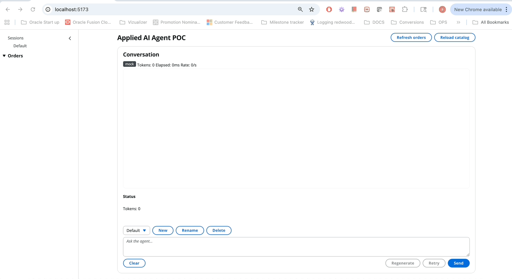
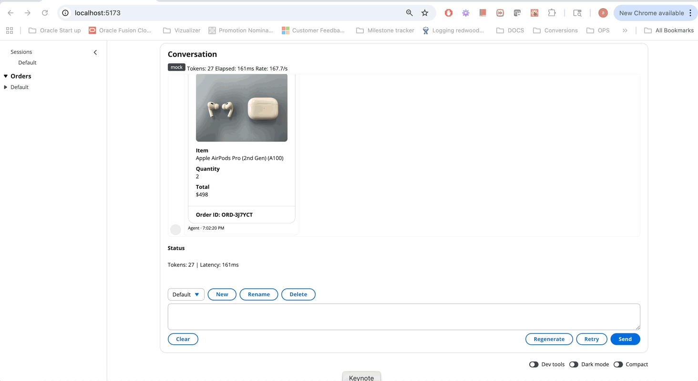

# Applied AI Agent POC

## Quick demo


## More demos
- Alternate take

	

See the full introduction with features and a UI preview in `docs/INTRODUCTION.md`.

Architecture and APIs:
- Architecture: `docs/ARCHITECTURE.md`
- API Reference: `docs/API.md`

Note: No AWS required to run or demo. Bedrock is optional; 

An agentic UI that can understand user intent, search a catalog, propose a purchase, and place an order with confirmation — all with responsive streaming UX.

## Highlights
- Agentic flow: intent detection (search/buy/confirm/cancel) with multi-turn memory (pending orders per client)
- Real-time UX: Server-Sent Events (SSE) token streaming; Stop/Retry/Regenerate controls
- Structured results: server emits a typed `order` event; UI renders a rich OrderCard in the conversation
- Cloudscape UI: AppLayout, SideNavigation, Container; centralized styles; footer Developer Tools
- Display options: dark mode and compact density toggles (persisted)
- Performance: virtualized message list; code-splitting; lazy-loaded shell
- State & persistence: Zustand with session switching and localStorage persistence
- Zero setup: mock backend by default; no cloud credentials needed
- Search quality: synonyms expansion and item keywords (e.g., "earphone" → earbuds/buds/in‑ear/IEM)
- UX polish: sticky input, auto-scroll during streaming, centered spinners, read-only catalog list in footer tools
- Orders UX: sidebar groups orders by session (collapsible); clicking an order switches to that session, scrolls to the confirmation in chat, and opens details in the footer

## Run locally
```zsh
npm install
# start both frontend and backend in parallel
npm run dev:all
```
Then open the printed URL (typically http://localhost:5173). Backend runs at http://localhost:8787.

If you prefer two terminals:
```zsh
# Terminal 1
npm run dev
# Terminal 2
npm run dev:server
```
Prerequisites
- Node.js 18+ (recommended 20+)
- macOS/Linux/Windows

Scripts
- dev: Vite dev server
- dev:server: Express SSE backend
- dev:all: Run both in parallel
- build: Type-check and build production assets
- preview: Serve built assets
- test / test:watch: Run Vitest tests

## Try it
In the Conversation panel (agent):
- "find airpods"
- "I want to buy earphones"
- "can I buy airpods qty 2?"
- "please order A100 x2"
- "yes"

You’ll see streaming results, then an order confirmation card. Use Stop during a stream; Retry or Regenerate as needed.

Optional: use the “Dev tools” toggle at the bottom of the page to show the footer Developer Tools with a read-only catalog list.

Search + buy tips
- The backend expands common synonyms so generic terms work:
	- earphone → earbuds, buds, in‑ear, IEM
	- airpod → airpods
	- sony → xm5 / wf‑1000xm5
	- samsung → galaxy buds
- Catalog items also include curated `keywords` in `server/data/catalog.json` for better matches.
- Conversational buy phrases with "buy"/"order" are recognized, e.g. "I want to buy earphones". Generic phrases without buy/order (e.g., "I want earphones") will perform a search only if you add buy/order.
- Quantity formats understood: `qty 2`, `quantity 3`, `x2`, or a bare number after a pending item (e.g., `3`).
	- If the catalog shows multiple items, a prompt quantity like `qty 2` applies to all visible items' selectors.
 - Minor typos are tolerated (e.g., "earins" → earbuds) via lightweight fuzzy matching.

## Status bar
Shows backend mode (mock or bedrock), token count, elapsed time, and rate.

## Tests
Run the minimal server and store tests:
```zsh
npm run test
```
Expected: 5 passing tests (server endpoints + store behaviors).

## Appendix: AWS Bedrock (optional)
Enable real model streaming (else the server uses a mock stream):

1) Create `.env` in the project root:
```
AWS_REGION=us-east-1
BEDROCK_MODEL_ID=anthropic.claude-3-haiku-20240307-v1:0
```
2) Ensure AWS credentials can invoke Bedrock Runtime.
3) Start as usual (`npm run dev:all`). The server will switch to Bedrock if `BEDROCK_MODEL_ID` is present.

## Tech stack
- React 19 + TypeScript (Vite)
- Cloudscape Design System
- Zustand state management
- Express + CORS SSE server
- TanStack Virtual (message list)

## Developer Tools (footer)
- Use the “Dev tools” toggle at the bottom of the page to reveal a footer section with:
	- Read‑only catalog list (images, title, ID, price) – no buying/quantity controls
	- Order details viewer (click an order in the sidebar to switch to the session, scroll to the confirmation in chat, and auto-scroll to the footer details)
 - Next to the Dev tools toggle you’ll find Dark mode and Compact density switches. Preferences persist in localStorage.

## Configuration
- `.env` (optional)
	- `IMAGE_SOURCE=catalog|unsplash|picsum` – prefer catalog images by default
	- `PUBLIC_CATALOG_SOURCE=dummyjson` – use public DummyJSON catalog instead of local JSON (demo)
	- `AWS_REGION`, `BEDROCK_MODEL_ID` – enable Bedrock streaming when set (see Appendix)
	- `FUZZY_SHORT_MAX_DISTANCE` (default 1), `FUZZY_LONG_MAX_DISTANCE` (default 2) – tune typo tolerance for tokens ≤4 chars and >4 chars

## Notes 
- The app demonstrates agentic behavior: intent detection → tool use → confirmation loop → structured UI output.
- Front-end concerns addressed: streaming UX, state persistence, virtualization, code-splitting, error boundaries.
- Extensible to function/tool-calling via Bedrock; rules are used for a predictable local demo.

## Troubleshooting
- If the UI loads but search/chat seem idle, ensure the backend is running:
	- http://localhost:8787/api/status
	- http://localhost:8787/api/catalog/search?q=airpods
- If `npm run dev:all` fails with "package.json not found", ensure you’re in this folder before running scripts.
- If port 5173 is taken, Vite will pick 5174+; use the printed URL.
- If the input box isn’t visible, the conversation area may be tall on your device; it’s now sticky at the bottom, and the chat area auto-scrolls during streams.
- Orders list not updating? It refreshes automatically after an order; you can also click “Refresh orders” in the header.

<!-- UI preview GIF steps removed to keep repo lean. -->
